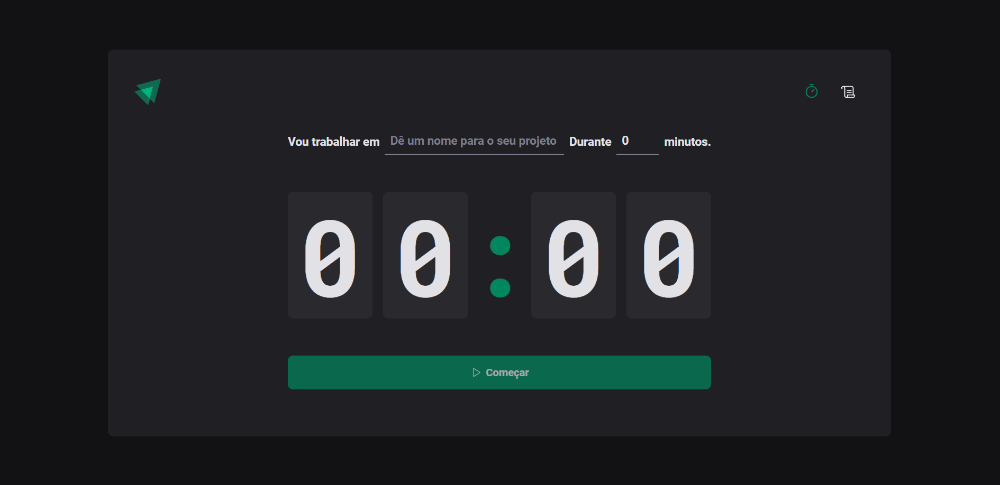
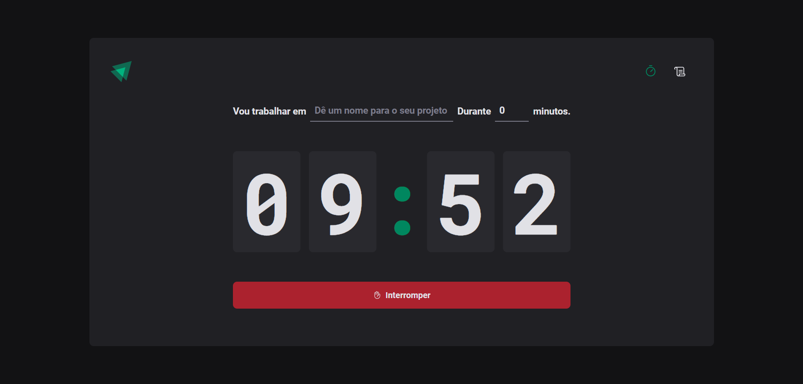
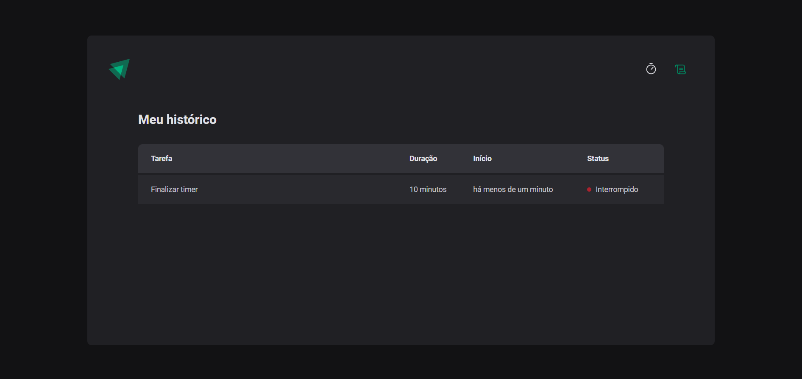

# 02-ignite-timer

Projeto desenvolvido durante o módulo 2 do [Ignite](https://lp.rocketseat.com.br/ignite?&).
 
O projeto desenvolvido é um timer de estudos no estilo pomodoro.

## Aprendizado

A partir da construção do projeto foi possível entender a dinâmica da estilização in JS, definindo estilos globais, configuração de temas para aplicação, bem como configurar a tipagem desse tema. 
 
Na aplicação foi utilizado o [ESLint](https://eslint.org/) para definir os padrões de projeto, neste caso foi utilizado o padrão da própria Rocketseat.
 
Além disso, foi apresentado o conceito de rotas no React com o uso da biblioteca React Router. O formulário, que contém os inputs e botão submit, foram tratados com a biblioteca React Hook Form e os campos validados com a biblioteca Zod integrada ao React Hook Form.
 
Novas funcionalidades do React foram apresentadas, sendo elas: Context e useReducer.

## Contrução

- Construído com [Vite](https://vitejs.dev/);
- Estilização com [Styled-components](https://styled-components.com/);
- [React Router](https://reactrouter.com/en/main) para criação das rotas da aplicação;
- [React Hook Form](https://react-hook-form.com/) para lidar com formulários;
- [Zod](https://github.com/colinhacks/zod) para validação de formulários;
- [Date fns](https://date-fns.org/) para lidar com datas;
- [Immer](https://github.com/immerjs/immer) para lidar com estados.

## Deploy da aplicação

 

Caso prefira abrir a aplicação no localhost basta digitar o comando `npm run dev`

## Design da aplicação

## Dados complementares

- Autor: [Yasmin](https://www.linkedin.com/in/yasmin-goncalves/)
- Challenge by: [Rocketseat](https://www.rocketseat.com.br/)

 
